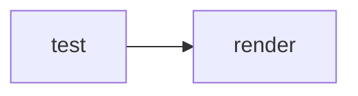

# Taimoor Khan — AI engineer, Karachi

I take AI-built prototypes to production: **AI agents, RAG systems, and the backend underneath them.**

Founders ship an MVP with a coding agent, it demos well, then it meets real users and real data. That gap — auth that leaks across tenants, retrieval that hallucinates, a queue with no idempotency, zero tests, no way to tell what broke — is the work I do. TypeScript and NestJS on the backend, Next.js and React on the front, PostgreSQL and Supabase underneath.

**Available for contract and freelance work.** Email [khant8k83@gmail.com](mailto:khant8k83@gmail.com) or message me on [LinkedIn](https://linkedin.com/in/taimoorkhan55).

---

## What I do

**Take an AI-built MVP to production.** Tenant isolation, authentication and session handling, payment integration, migrations, error handling, tests, and the observability needed to debug it at 2am. The unglamorous layer between "the demo works" and "we can charge for this".

**Build AI agents and RAG systems that hold up.** Tool design and permission boundaries enforced outside the model, multi-tenant retrieval where tenant identity comes from the session and never from the model, streaming responses with provenance, and evals so behaviour is measured rather than vibed.

**Clean up vibe-coded repositories.** Codebases generated fast by AI, now unmaintainable: no boundaries, duplicated logic, silent breakage. I give them a structure a human team and a coding agent can both work inside.

**Review before launch.** Adversarial, whole-repository audits of security, data integrity, deployment and test coverage — with a go/no-go answer, not a list of nits.

## How I work: agent-first engineering

Humans make the engineering decisions. Agents do the work inside them.

Architecture, API contracts, data model, boundaries and allowed dependencies are decided by people and written into the repository, so neither a new engineer nor a coding agent has to re-derive them. Within those constraints an agent picks the implementation freely. Outside them — a new dependency, a new service, a schema change with a migration path — it raises the blocker instead of inventing an answer.

That principle is why the tools below exist: they encode the decision, so it only has to be made once.

## Open source

**[prod-readiness](https://github.com/Taimoorkhan1122/prod-readiness)** — Production-readiness audit plugin for Claude Code. Seven parallel specialist agents review security, backend, database, DevOps, QA, frontend and AI-security concerns over one shared evidence pass, and return a SHIP / FIX THEN SHIP / HOLD verdict with an evidence ledger. Built for teams shipping AI-generated code.

**[boring-react](https://github.com/Taimoorkhan1122/boring-react)** — Agent Skills that make coding agents write boring, production-grade React: no needless `useEffect`, no surprise dependencies, no cargo-cult memoization. Portable `SKILL.md` format, 12 adversarial evals.

**[langraph_agent](https://github.com/Taimoorkhan1122/langraph_agent)** — Hierarchical LangGraph agent on NestJS. An LLM classifies each query, a StateGraph routes it to RAG, chart, direct or hybrid branches, retrieval runs per-tenant against Weaviate, and the answer streams over SSE with file and page references.

**[ecommerce-backend](https://github.com/Taimoorkhan1122/ecommerce-backend)** — E-commerce API in TypeScript with Node, Express, GraphQL and PostgreSQL.

## Stack

- **Languages** — TypeScript, JavaScript, Python, SQL, some Rust
- **Backend** — Node.js, NestJS, Express, GraphQL, REST, WebSockets, Server-Sent Events
- **Frontend** — React, Next.js, TanStack Query, Tailwind CSS, Vite
- **Data** — PostgreSQL, Supabase, MongoDB, Redis, Weaviate, pgvector
- **AI** — LangGraph, LangChain, RAG pipelines, agent tooling and evals, Claude Code, Codex, MCP
- **Infrastructure** — Docker, Kubernetes, GitHub Actions, Cloudflare Workers, Vercel

## Background

Six years building for the web, starting in 2020 with React frontends and moving to backend and platform work from 2021. Currently at Geeks of Kolachi in Karachi, Pakistan, working across full-stack product delivery and AI systems. I work remotely.

## Contact

- **Email** — [khant8k83@gmail.com](mailto:khant8k83@gmail.com)
- **LinkedIn** — [linkedin.com/in/taimoorkhan55](https://linkedin.com/in/taimoorkhan55)
- **X** — [@Taimi360](https://x.com/Taimi360)
- **Stack Overflow** — [taimoor](https://stackoverflow.com/users/12393165/taimoor)
- **Website** — [tamork.tech](http://tamork.tech/)

Best first message: what you have built, what is breaking, and when you need it working.

<!-- render-test -->

> [!NOTE]
> alert render test
